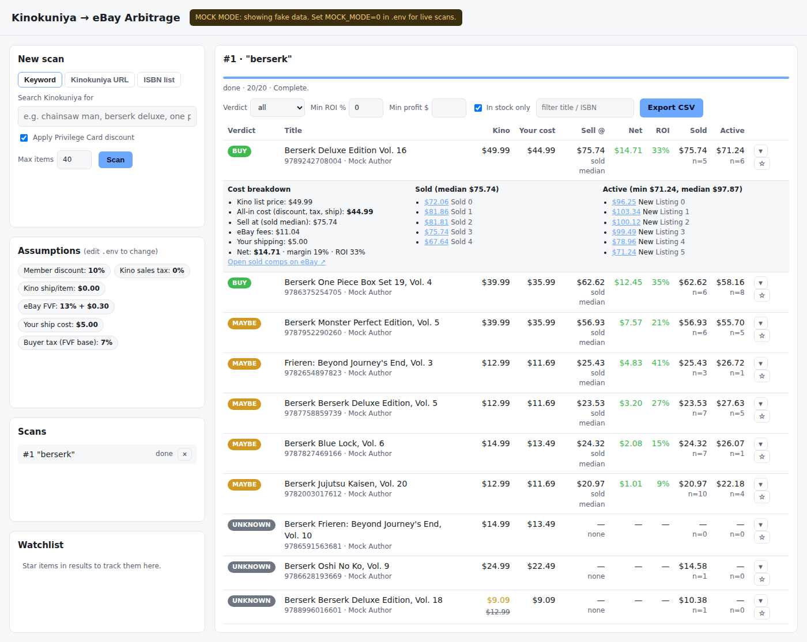

# Kinokuniya → eBay Arbitrage Scanner

A small self-hosted web app that scrapes [Kinokuniya USA](https://united-states.kinokuniya.com),
looks up what the same ISBNs are selling for on eBay, subtracts every fee, and tells you
what's worth flipping.



## How it works

1. **Find products on Kinokuniya.** Three input modes:
   - *Keyword* – searches Kinokuniya (`/products?keyword=…`) and walks the result pages.
   - *URL* – paste any Kinokuniya listing page (a category, a sale/bargain taxon, a series page).
   - *ISBN list* – paste ISBNs and it fetches each product page directly.

   The parser keys off product links (`/products/<ISBN13>`), so it survives most markup changes.
   It picks up list price, sale price (struck-through price → markdown), author, image and stock status.

2. **Pull eBay comps for each ISBN.**
   - **Active listings** come from eBay's official Browse API using a GTIN (=ISBN-13) lookup,
     filtered to new-condition, fixed-price, US-located items.
   - **Sold listings** (the real ground truth) are optionally scraped from eBay's public
     "Sold items" search. Off by default because eBay's terms of use prohibit scraping; flip
     `EBAY_SOLD_SCRAPE=1` if you accept that.
   - Comps are cached in SQLite for 6 hours so re-scans are cheap.

3. **Score each item.**
   - *Cost basis* = Kinokuniya price → minus Privilege Card discount (not stacked on sale items)
     → plus sales tax → plus Kinokuniya shipping.
   - *Sell-at price* = median sold price when we have ≥2 sold comps, otherwise $1 under the
     cheapest active listing.
   - *Net* = sell price − eBay final value fee (applied to price + buyer tax) − per-order fee −
     your shipping cost − cost basis.
   - Verdict: **buy** (net ≥ $5 and ROI ≥ 25%), **maybe** (net > 0), **pass**, or **unknown**
     (no comps found).

4. **Browse.** Sortable/filterable table, expandable fee breakdown with links to the actual
   eBay listings, CSV export, and a watchlist you can re-scan with one click.

## Quick start

```bash
cp .env.example .env        # then fill in EBAY_CLIENT_ID / EBAY_CLIENT_SECRET
./run.sh                    # http://localhost:8000
```

Or with Docker:

```bash
docker build -t kino-arb .
docker run -p 8000:8000 --env-file .env -v kino-data:/data kino-arb
```

### Try it without credentials

```bash
MOCK_MODE=1 ./run.sh
```

Mock mode serves deterministic fake Kinokuniya and eBay data so you can click around the UI.

### eBay API keys

1. Sign up at <https://developer.ebay.com> and create a **production** keyset.
2. Put the App ID (client ID) and Cert ID (client secret) into `.env`.
3. The app uses the client-credentials OAuth flow with the public `api_scope`, no user login needed.
   The free tier allows 5,000 Browse API calls/day, which is plenty.

## Tuning the fee model

All assumptions live in `.env` and are shown in the UI's "Assumptions" panel:

| Variable | Default | Meaning |
| --- | --- | --- |
| `KINO_MEMBER_DISCOUNT` | 0.10 | Privilege Card discount |
| `KINO_SALES_TAX` | 0.0 | Tax you pay Kinokuniya (0 if you have a resale cert) |
| `KINO_SHIPPING_PER_ITEM` | 0.0 | Kinokuniya shipping per item (0 if buying in store) |
| `EBAY_FVF_RATE` | 0.1325 | Final value fee, Books & Magazines category |
| `EBAY_PER_ORDER_FEE` | 0.30 | Per-order fee |
| `EBAY_SHIP_COST` | 5.00 | What Media Mail + packaging costs you |
| `BUYER_TAX_RATE` | 0.07 | Buyer sales tax (eBay charges FVF on it) |
| `REQUEST_DELAY_SECONDS` | 1.5 | Politeness delay between requests |
| `MAX_ITEMS_PER_SCAN` | 60 | Cap per scan |

## Layout

```
arbitrage/
  kinokuniya.py   scraper + HTML parsers
  ebay.py         Browse API client + optional sold-listings scraper
  pricing.py      fee / profit / verdict math (pure functions)
  scanner.py      runs a scan in the background, streams results to SQLite
  db.py           SQLite: scans, results, eBay cache, watchlist
  mock.py         fake data for MOCK_MODE
  main.py         FastAPI app + JSON API
static/           vanilla JS frontend
tests/            parser fixtures, pricing math, API lifecycle
```

## Tests

```bash
python -m pytest -q
```

## "Kinokuniya fetch failed: 403"

Kinokuniya's bot protection fingerprints the TLS handshake, so a plain HTTP client gets a 403.
The app tries two things automatically (`KINO_FETCHER=auto`):

1. `curl_cffi`, which impersonates Chrome's network fingerprint. Installed by `requirements.txt`.
2. A real headless Chromium through Playwright, if that is still blocked. One-time setup:
   ```bash
   pip install playwright
   playwright install chromium
   ```
   Set `KINO_FETCHER=browser` in `.env` to always use the browser (slower, most reliable).

## Caveats

- Kinokuniya's markup isn't versioned. If a scan returns zero items, open a search page in your
  browser, save the HTML into `tests/fixtures/`, and adjust `parse_listing` – the tests will
  guide you.
- Scraping is rate-limited to one request every 1.5 s. Keep it that way.
- Sold-comp scraping of eBay is against their ToS. The Browse API path is fully compliant.
- "Buy" is a hint, not financial advice. Check sell-through velocity before buying twenty copies.
